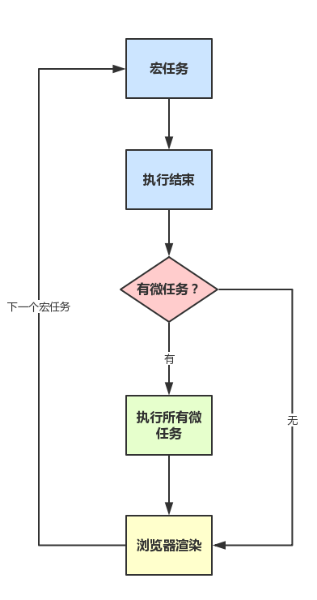
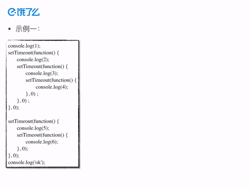
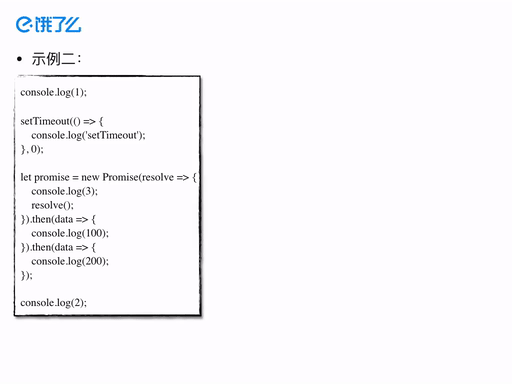

## `为什么JavaScript是单线程？`

JavaScript语言的一大特点就是单线程，也就是说，同一个时间只能做一件事。那么，为什么JavaScript不能有多个线程呢？这样能提高效率啊。

JavaScript的单线程，与它的用途有关。作为浏览器脚本语言，JavaScript的主要用途是与用户互动，以及操作DOM。这决定了它只能是单线程，否则会带来很复杂的同步问题。比如，假定JavaScript同时有两个线程，一个线程在某个DOM节点上添加内容，另一个线程删除了这个节点，这时浏览器应该以哪个线程为准？

所以，为了避免复杂性，从一诞生，JavaScript就是单线程，这已经成了这门语言的核心特征，将来也不会改变。

为了利用多核CPU的计算能力，HTML5提出Web Worker标准，允许JavaScript脚本创建多个线程，但是子线程完全受主线程控制，且不得操作DOM。所以，这个新标准并没有改变JavaScript单线程的本质。

## `Event Loop`

参考地址:[Event Loop 这个循环你晓得么？(附 GIF 详解)-饿了么前端](https://zhuanlan.zhihu.com/p/41543963)

1. js解析方法时，将同步任务排队到执行栈中，异步任务排队到事件队列中。
2. 事件队列分为:

   - 宏任务：setTimeout，setInterval，setImmediate，I/O，UI交互事件
   - 微任务：process.nextTick，Promise.then
  
3. 浏览器环境中执行方法时，先将执行栈中的任务清空，再将微任务推到执行栈中并清空，之后检查是否存在宏任务，若存在则取出一个宏任务，执行完成检查是否有微任务，以此循环…

4. Event Loop在浏览器与node环境中的区别：
    - 浏览器环境每次执行一个宏任务，再去检查微任务
    - node会清空当前所处阶段的队列，即执行所有task，再去检查微任务

## `任务队列的本质`

1. 所有同步任务都在主线程上执行，形成一个`执行栈`（execution context stack）。
2. 主线程之外，还存在一个`任务队列`（task queue）。只要异步任务有了运行结果，就在`任务队列`之中放置一个事件。
3. 一旦`执行栈`中的所有同步任务执行完毕，系统就会读取`任务队列`，看看里面有哪些事件。那些对应的异步任务，于是结束等待状态，进入执行栈，开始执行。

- 主线程不断重复上面的第三步。

## `异步任务`

- setTimeOut、setInterval
- DOM 事件
- Promise

## `JavaScript 实现异步编程的方法？`

- 回调函数
- 事件监听
- 发布/订阅
- Promises 对象
- Async 函数[ES7]

## `关于 setTimeOut、setImmediate、process.nextTick()的比较`

### `setTimeout()`

将事件插入到了事件队列，必须等到当前代码（执行栈）执行完，主线程才会去执行它指定的回调函数。
当主线程时间执行过长，无法保证回调会在事件指定的时间执行。
浏览器端每次setTimeout会有4ms的延迟，当连续执行多个setTimeout，有可能会阻塞进程，造成性能问题。

### `setImmediate()`

事件插入到事件队列尾部，主线程和事件队列的函数执行完成之后立即执行。和setTimeout(fn,0)的效果差不多。
服务端node提供的方法。浏览器端最新的api也有类似实现:window.setImmediate,但支持的浏览器很少。

### `process.nextTick()`

插入到事件队列尾部，但在下次事件队列之前会执行。也就是说，它指定的任务总是发生在所有异步任务之前，当前主线程的末尾。
大致流程：当前”执行栈”的尾部–>下一次Event Loop（主线程读取”任务队列”）之前–>触发process指定的回调函数。
服务器端node提供的办法。用此方法可以用于处于异步延迟的问题。
可以理解为：此次不行，预约下次优先执行。

### [浏览器的Tasks、microtasks、 queues 和 schedules](https://github.com/sisterAn/blog/issues/21)

### `Promise`

Promise本身是同步的立即执行函数， 当在 executor 中执行 resolve 或者 reject 的时候, 此时是异步操作， 会先执行 then/catch 等，当主栈完成后，才会去调用 resolve/reject 中存放的方法执行，打印 p 的时候，是打印的返回结果，一个 Promise 实例。

### `async await`

Async/Await就是一个自执行的generate函数。利用generate函数的特性把异步的代码写成“同步”的形式。

`async` 函数返回一个 `Promise 对象`，当函数执行的时候，一旦遇到 `await` 就会先返回，等到触发的异步操作完成，再执行函数体内后面的语句。`让出线程`，跳出了 `async` 函数体。
