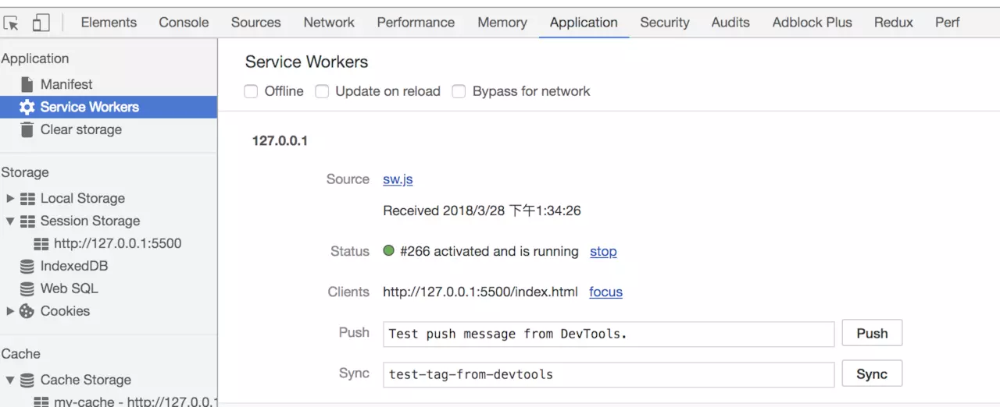

# `Service Worker`

Service Worker 是运行在浏览器背后的独立线程，一般可以用来实现**缓存**功能。使用 Service Worker的话，传输协议必须为 `HTTPS`。因为 Service Worker 中涉及到请求拦截，所以必须使用 HTTPS 协议来保障安全。

Service Worker 实现缓存功能一般分为三个步骤：

1. 首先需要先注册 Service Worker，
2. 然后监听到 install 事件
3. 以后就可以缓存需要的文件，

那么在下次用户访问的时候就可以通过拦截请求的方式查询是否存在缓存，存在缓存的话就可以直接读取缓存文件，否则就去请求数据。以下是这个步骤的实现：

```js
// index.js
if (navigator.serviceWorker) {
  navigator.serviceWorker
    .register('sw.js')
    .then(function(registration) {
      console.log('service worker 注册成功')
    })
    .catch(function(err) {
      console.log('servcie worker 注册失败')
    })
}

// sw.js
// 监听 `install` 事件，回调中缓存所需文件
self.addEventListener('install', e => {
  e.waitUntil(
    caches.open('my-cache').then(function(cache) {
      return cache.addAll(['./index.html', './index.js'])
    })
  )
})

// 拦截所有请求事件
// 如果缓存中已经有请求的数据就直接用缓存，否则去请求数据
self.addEventListener('fetch', e => {
  e.respondWith(
    caches.match(e.request).then(function(response) {
      if (response) {
        return response
      }
      console.log('fetch source')
    })
  )
})
```

打开页面，可以在开发者工具中的 Application 看到 Service Worker 已经启动了


在 Cache 中也可以发现我们所需的文件已被缓存


当我们重新刷新页面可以发现我们缓存的数据是从 Service Worker 中读取的


### 好文链接

- <https://www.zcfy.cc/article/service-worker-what-are-you-mariko-kosaka-1927.html>
- <https://juejin.im/post/5ba0fe356fb9a05d2c43a25c>
- <https://juejin.im/post/5bf3f656e51d45338e084044>
- <https://juejin.im/post/5bf3f6b2e51d45360069e527>
