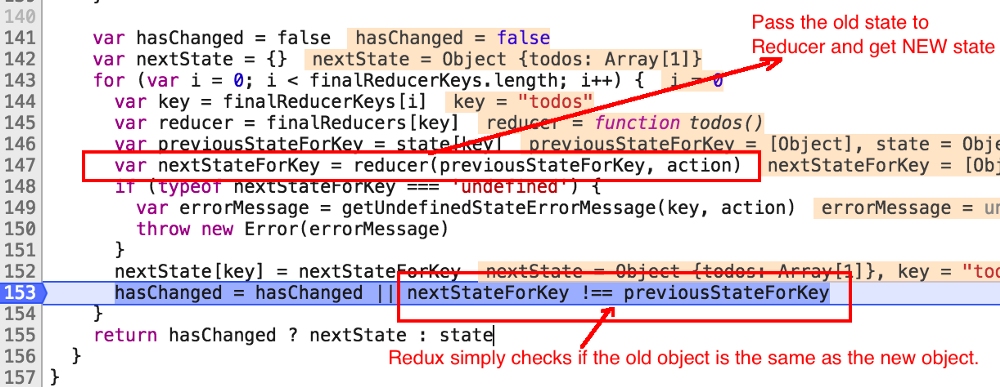

### redux简介

redux 是一个应用数据流框架，主要是解决了组件间状态共享的问题，原理是集中式管理，主要有三个核心方法，`action，store，reducer`

工作流程是： 
 - view用actionCreator创建一个action,里面可能包含一些数据
 - 使用store的dispatch方法将acion传入store
 - store将action与旧的state转发给reducer
 - reducer深拷贝state,并返回一个新的state给store
 - store接收并更新state
 - 使用store.subscribe订阅更新,重新render组件

### reducer为什么是纯函数？
从本质上讲，纯函数的定义如下：不修改函数的输入值，依赖于外部状态（比如数据库，DOM和全局变量），同时对于任何相同的输入有着相同的输出结果。

阅读源码可以看到，Redux接收一个给定的state（对象），然后通过循环将state的每一部分传递给每个对应的reducer。如果有发生任何改变，reducer将返回一个新的对象。如果不发生任何变化，reducer将返回旧的state。

Redux只通过比较新旧两个对象的存储位置来比较新旧两个对象是否相同（也就是Javascript对象浅比较）。如果你在reducer内部直接修改旧的state对象的属性值，那么新的state和旧的state将都指向同一个对象。因此Redux认为没有任何改变，返回的state将为旧的state。

深比较在真实的应用当中代价昂贵，因为通常js的对象都很大，同时需要比较的次数很多。

因此一个有效的解决方法是作出一个规定：无论何时发生变化时，开发者都要创建一个新的对象，然后将新对象传递出去。同时，当没有任何变化发生时，开发者发送回旧的对象。也就是说，新的对象代表新的state。  使用了新的策略之后，你能够比较两个对象通过使用!==比较两个对象的存储位置而不是比较两个对象的所有属性。