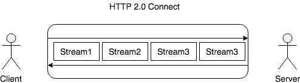

# `HTTP`

HTTP是Hyper Text Transfer Protocol（超文本传输协议）的缩写。它是一个**应用层**协议，由请求和响应构成，是一个标准的客户端服务器模型。HTTP是一个无状态的协议。

### `HTTP协议的特点`

- 无连接
  - 限制每次连接只处理一个请求
- 无状态
  - 协议对于事务处理没有记忆能力。
- 简单快速
  - 客户向服务器请求服务时，只需传送请求方法和路径。
- 灵活
  - HTTP允许传输任意类型的数据对象。正在传输的类型由Content-Type加以标记。

### `请求报文`

- 请求行
  - 请求方法（GET）
  - 要访问的资源（request-URI）
  - HTTP协议版本号（HTTP/1.1）
- 请求头
  - 用来说明服务器要使用的附加信息（一些键值对）
  - 例如：User-Agent、 Accept、Content-Type、Connection
- 空行
  - 分割请求头与请求体
- 请求体
  - 可以添加任意的其他数据

### `响应报文`

- 状态行
  - 状态码（200）
  - 状态码描述（OK）
  - HTTP协议版本号（HTTP/1.1）
- 消息头
  - 说明客户端要使用的一些附加信息
  - 如：Content-Type、charset、响应的时间
- 空行
  - 分割请求头与请求体
- 响应正文
  - 返回给客户端的文本信息

### `HTTP请求方法`

**HTTP 1.0**

- `GET` -- **获取资源**
  - GET请求会显示请求指定的资源。一般来说GET方法应该只用于数据的读取，而不应当用于会产生副作用的非幂等的操作中。GET方法请求指定的页面信息，并返回响应主体，GET被认为是不安全的方法，因为GET方法会被网络蜘蛛等任意的访问。
  
- `POST` -- **传输资源**
  - POST请求会向指定资源提交数据，请求服务器进行处理。如：表单数据提交、文件上传等，请求数据会被包含在请求体中。POST方法是非幂等(有副作用)的方法，因为这个请求可能会创建新的资源或/和修改现有资源。
  
- `HEAD` -- **获取响应报文Headers**
  - HEAD方法与GET方法一样，都是向服务器发出指定资源的请求。但是，服务器在响应HEAD请求时不会回传资源的内容(响应主体)。这样，我们可以在不传输全部内容的情况下，就可以获取服务器的响应头信息。HEAD方法常被用于客户端查看服务器的性能。

**HTTP 1.1 新增**

- `PUT` -- **更新资源**
  - PUT请求会向指定资源位置上传其最新内容，PUT方法是幂等的方法。通过该方法客户端可以将指定资源的最新数据传送给服务器取代指定的资源的内容。

- `DELETE` -- **删除资源**
  - DELETE用于请求服务器删除所请求**URI**（统一资源标识符，Uniform Resource Identifier）所标识的资源。DELETE请求后指定资源会被删除，DELETE方法也是幂等的。

- `OPTIONS` -- **查看性能**
  - OPTIONS请求与HEAD类似，一般也是用于客户端查看服务器的性能。 这个方法会请求服务器返回该资源所支持的所有HTTP请求方法，该方法会用 ‘ * ’ 来代替资源名称，向服务器发送OPTIONS请求，可以测试服务器功能是否正常。JavaScript的XMLHttpRequest对象进行CORS跨域资源共享时，就是使用OPTIONS方法发送嗅探请求，以判断是否有对指定资源的访问权限。
  
- `TRACE` -- **回显请求**
  - TRACE请求服务器回显其收到的请求信息，该方法主要用于HTTP请求的测试或诊断。
  
- `CONNECT` -- **改连接为管道方式的代理服务器**
  - CONNECT方法是HTTP/1.1协议预留的，能够将连接改为管道方式的代理服务器。通常用于SSL加密服务器的链接与非加密的HTTP代理服务器的通信。

**HTTP 1.1 后新增**

- `PATCH`
  - 补丁方法，适用于提交部分修改的资源。

### `POST` 和 `GET` 的区别

- `GET`在浏览器回退时是无害的，而`POST`会再次提交
- `GET`请求能缓存，`POST`不能
- `POST`相对`GET`相对安全一些，因为`GET`请求都包含在URL中，而且会被浏览器保存记录，`POST`不会。但是在抓包的情况下都是一样的。
- URL有长度限制，会影响 `GET` 请求，这个长度限制是浏览器规定的
- `POST` 可以通过 request body来传输比 `GET` 更多的数据
- `POST` 支持更多的编码类型且不对数据类型限制, `GET`只有UrlEcode
- `POST` 浏览器先发送header，服务器响应100 continue，浏览器再发送data，服务器响应200 ok(返回数据)

先引入副作用和幂等的概念。

副作用指对服务器上的资源做改变，搜索是无副作用的，注册是副作用的。

幂等指发送 M 和 N 次请求（两者不相同且都大于 1），服务器上资源的状态一致，比如注册 10 个和 11 个帐号是不幂等的，对文章进行更改 10 次和 11 次是幂等的。

在规范的应用场景上说，GET 多用于无副作用，幂等的场景，例如搜索关键字。POST 多用于副作用，不幂等的场景，例如注册。

## `常见状态码`

### `1XX` **指示信息**

- `100` continue 表示请求已接收，继续处理

### `2XX` **成功**

- **`200`** OK
- `204` No content，表示请求成功，但响应报文不含实体的主体部分
- `205` Reset Content，表示请求成功，但响应报文不含实体的主体部分，但是与 204 响应不同在于要求请求方重置内容
- **`206`** Partial Content，进行范围请求

### `3XX` **重定向**

- **`301`** Moved Permanently，永久性重定向，表示资源已被分配了新的 URL 当浏览器收到的HTTP状态码为301时，下次访问对应网址就直接调整到新的网址，不会再访问原网址
- **`302`** Found，临时性重定向，表示资源临时被分配了新的 URL 浏览器每次访问都要先去目标网址访问，再重定向到新的网址
- `303` See Other，表示资源存在着另一个 URL，应使用 GET 方法获取资源
- **`304`** Not Modified，未修改，重定位到浏览器。自从上次请求后，请求的网页未修改过。服务器返回此响应时，不会返回网页内容。如果网页自请求者上次请求后再也没有更改过，您应将服务器配置为返回此响应（称为 If-Modified-Since HTTP 标头）。服务器可以告诉 Googlebot 自从上次抓取后网页没有变更，进而节省带宽和开销。
- `307` Temporary Redirect，临时重定向，和302含义类似，但是期望客户端保持请求方法不变向新的地址发出请求

### 4XX **客户端错误**

- `400` Bad Request，请求报文存在语法错误
- `401` Unauthorized，表示发送的请求需要有通过 HTTP 认证的认证信息
- **`403`** Forbidden，表示对请求资源的访问被服务器拒绝
- **`404`** Not Found，在服务器上没有找到请求的资源

### 5XX **服务器错误**

- **`500`** Internal Server Error，表示服务器端在执行请求时发生了错误
- `501` Not Impelemented，表示服务器不支持当前请求所需要的某个功能
- **`503`** Service Unvaliable，表明服务器暂时处于超负载或正在停机维护，无法处理请求

## `HTTP持久连接`（HTTP1.1支持）

HTTP协议采用“请求-应答”模式，并且HTTP是基于TCP进行连接的。普通模式（非keep-alive）时，每个请求或应答都需要建立一个连接，完成之后立即断开。

当使用`Conection: keep-alive`模式（又称持久连接、连接重用）时，keep-alive使客户端道服务器端连接持续有效，即不关闭底层的TCP连接，当出现对服务器的后继请求时，keep-alive功能避免重新建立连接。

### `HTTP管线化` （HTTP1.1支持）

管线化后，请求和响应不再是依次交替的了。他可以支持一次性发送多个请求，并一次性接收多个响应。

- 只有GET与head请求可以进行管线化，POST有限制
- 初次创建连接时不应该启动管线机制，因为服务器不一定支持该协议

### `HTTP数据协商`

在客户端向服务端发送请求的时候，客户端会申明可以接受的数据格式和数据相关的一些限制是什么样的；服务端在接受到这个请求时他会根据这个信息进行判断到底返回怎样的数据。

#### 请求

- Accept
  - 在请求中使用Accept可申明想要的数据格式
- Accept-Encoding
  - 告诉服务端使用什么方式来进行压缩
  - 例如：gzip、deflate、br
- Accept-Language
  - 描述语言信息
- User-Agent
  - 用来描述客户端浏览器相关信息
  - 可以用来区分PC端页面和移动端页面

#### 响应

- Content-Type
  - 对应Accept，从请求中的Accept支持的数据格式中选一种来返回
- Content-Encoding
  - 对应 Accept-Encoding，指服务端到底使用的是那种压缩方式
- Content-Language
  - 对应Accept-Language

#### form 表单中enctype(encode type)数据类型

- `application/x-www-form-urlencoded`
  - key=value&key=value 格式
- `multipart/form-data`
  - 用于提交文件
  - multipart表示请求是由多个部分组成（因为上传文件的时候文件不能以字符串形式提交，需要单独分出来）
  - boundary 用来分隔不同部分
- `text/plain`

### [HTTP CSP 内容安全策略](https://developer.mozilla.org/zh-CN/docs/Web/Security/CSP)

CSP Content-Security-Policy

- 限制资源获取
- 报告资源获取越权

例子：

- `Content-Security-Policy: default-src http: https:` 表示只允许通过http、https的方式加载资源
- `'Content-Security-Policy': 'default-src' \'self\'; form-action\'self\' '` 表示只能加载本域下的资源，只能向本域发送表单请求

## `HTTP 2.0`

HTTP 2.0 相比于 HTTP 1.X，可以说是大幅度提高了 web 的性能。

HTTP2采用`二进制格式传输`，取代了HTTP1.x的文本格式，二进制格式解析更高效。
`多路复用`代替了HTTP1.x的序列和阻塞机制，所有的相同域名请求都通过同一个TCP连接并发完成。

### **`二进制传输`**

`文本 -> 二进制`

HTTP 2.0 中所有加强性能的**核心**点在于此。在之前的 HTTP 版本中，我们是通过`文本`的方式传输数据。在 HTTP 2.0 中引入了新的编码机制，所有传输的数据都会被分割，并采用`二进制格式编码`。

### **`多路复用`**

`多个TCP -> 1个TCP`

HTTP1.x中，并发多个请求需要多个TCP连接，浏览器为了控制资源会有6-8个TCP连接都限制。
HTTP2中

- 同域名下所有通信都在`单个`连接上完成，消除了因多个 TCP 连接而带来的延时和内存消耗。
- 单个连接上可以并行交错的请求和响应，之间互不干扰

在 HTTP 2.0 中，有两个非常重要的概念，分别是`帧（frame）`和`流（stream）`。

**帧**代表着最小的数据单位，每个帧会标识出该帧属于哪个流，**流**也就是多个帧组成的数据流。

**多路复用，就是在一个 TCP 连接中可以存在多条流。** 换句话说，也就是可以发送多个请求，对端可以通过帧中的标识知道属于哪个请求。通过这个技术，可以避免 HTTP 旧版本中的队头阻塞问题，极大的提高传输性能。

### Header 压缩

在 HTTP 1.X 中，我们使用文本的形式传输 header，在 header 携带 cookie 的情况下，可能每次都需要重复传输几百到几千的字节。

在 HTTP 2.0 中，使用了 HPACK 压缩格式对传输的 header 进行编码，减少了 header 的大小。并在两端维护了索引表，用于记录出现过的 header ，后面在传输过程中就可以传输已经记录过的 header 的键名，对端收到数据后就可以通过键名找到对应的值。

### 服务端 Push

在 HTTP 2.0 中，服务端可以在客户端某个请求后，主动推送其他资源。

可以想象以下情况，某些资源客户端是一定会请求的，这时就可以采取服务端 push 的技术，提前给客户端推送必要的资源，这样就可以相对减少一点延迟时间。当然在浏览器兼容的情况下你也可以使用 prefetch。

### HTTP首部

|     通用字段      |                       作用                       |
| :---------------: | :----------------------------------------------: |
|   Cache-Control   |                  控制缓存的行为                  |
|    Connection     | 浏览器想要优先使用的连接类型，比如  `keep-alive` |
|       Date        |                   创建报文时间                   |
|      Pragma       |                     报文指令                     |
|        Via        |                代理服务器相关信息                |
| Transfer-Encoding |                   传输编码方式                   |
|      Upgrade      |                要求客户端升级协议                |
|      Warning      |               在内容中可能存在错误               |
---
|      请求字段       |                作用                |
| :-----------------: | :--------------------------------: |
|       Accept        |        能正确接收的媒体类型        |
|   Accept-Charset    |         能正确接收的字符集         |
|   Accept-Encoding   |      能正确接收的编码格式列表      |
|   Accept-Language   |        能正确接收的语言列表        |
|       Expect        |        期待服务端的指定行为        |
|        From         |           请求方邮箱地址           |
|        Host         |            服务器的域名            |
|      If-Match       |          两端资源标记比较          |
|  If-Modified-Since  | 本地资源未修改返回 304（比较时间） |
|    If-None-Match    | 本地资源未修改返回 304（比较标记） |
|     User-Agent      |             客户端信息           |
|    Max-Forwards     |    限制可被代理及网关转发的次数    |
| Proxy-Authorization |      向代理服务器发送验证信息      |
|        Range        |        请求某个内容的一部分        |
|       Referer       |    表示浏览器所访问的前一个页面    |
|         TE          |            传输编码方式          |
---
|      响应字段      |            作用            |
| :----------------: | :------------------------: |
|   Accept-Ranges    |   是否支持某些种类的范围   |
|        Age         | 资源在代理缓存中存在的时间 |
|        ETag        |          资源标识          |
|      Location      |   客户端重定向到某个 URL   |
| Proxy-Authenticate |  向代理服务器发送验证信息  |
|       Server       |         服务器名字         |
|  WWW-Authenticate  |   获取资源需要的验证信息   |
---
|     实体字段     |              作用              |
| :--------------: | :----------------------------: |
|      Allow       |       资源的正确请求方式       |
| Content-Encoding |         内容的编码格式         |
| Content-Language |         内容使用的语言         |
|  Content-Length  |       request body 长度        |
| Content-Location |       返回数据的备用地址       |
|   Content-MD5    | Base64加密格式的内容 MD5检验值 |
|  Content-Range   |         内容的位置范围         |
|   Content-Type   |         内容的媒体类型         |
|     Expires      |         内容的过期时间         |
|  Last_modified   |       内容的最后修改时间       |
