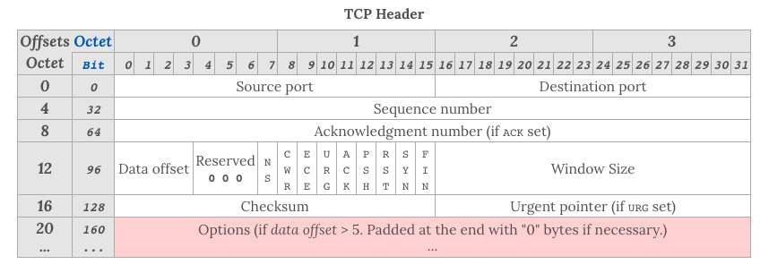

|       |     TCP    |     UDP     |
|:---:| :---: | :---: |
| 连接 | 有 |  无 |
| 可靠性 | 可靠，不重复，丢包重发，按顺序发送 |  不可靠，最大能力交付，丢包不重发，乱序发送 |
| 流量控制 拥塞算法 | 有 |  无 |
| 模式 | 数据报文 |  字节流 |
| 系统资源占用 | 多 |  少 |
| 首部 | 复杂，较大，20B |  简单，较小，8B |

