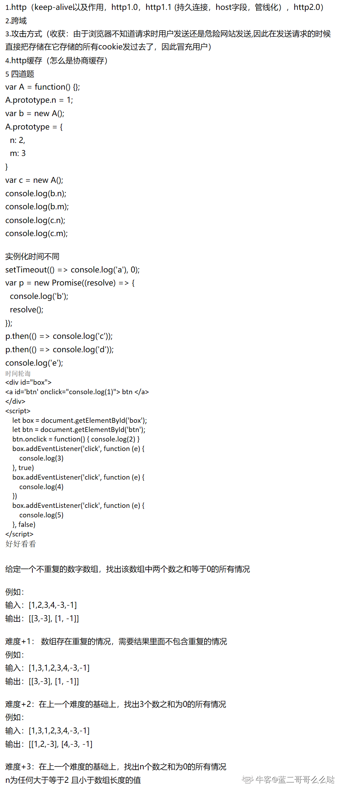
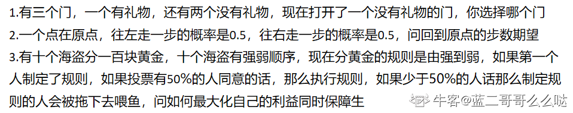

作者：JAZI6
链接：<https://www.nowcoder.com/discuss/112386?type=post&order=time&pos=&page=1>
来源：牛客网

1. c++和js区别  
2. 手写js继承实现  
3. 闭包，闭包数据缓存手写 (没写出来）  
4. 事件循环机制  
6. url->页面生成过程  
7. 性能优化  
8. es6新东西  
9. promise执行，事件循环机制  
10. http请求方式，最好了解常用的四个以外其他的那几个  
11. http缓存  
12. webpack  
13. 模块化规范，CMD原理是什么？（凉凉）  
14. vue响应式原理  
15. 实习经历  

作者：弹铁蛋同学
链接：<https://www.nowcoder.com/discuss/239268?type=post&order=time&pos=&page=1>
来源：牛客网

8.30 视频面大概1个小时左右，包括聊天。

1. document.getElementById()的实现思路；
2. 栈，队列，数组，链表，链表查找的时间复杂度、数组查找的时间复杂度。
3. hash，我说我忘了。
4. 路由的出栈入栈，跳转
5. 一些关于this、箭头函数的代码输出结果的相关题目
6. bind的实现思路
7. 请求、响应的头部字段
8. 强缓存和协商缓存
9. 三次握手、四次挥手为什么要最后一次
10. 一个div的水平居中
11. flex的水平居中
12. 一个div的放大镜图标的实现（提示用伪元素）
13. keep-alive，和实现思路
14. vue-router的缓存实现？
15. visibility:hidden，display:none，opacity
16. visibility:hidden，opacity点击是否触发事件
17. Vue的双向绑定
18. Vue组件的通信方式
19. 组件间通信方式自己实现的话的实现思路
20. 发布订阅设计模式，观察者模式，两者的区别
21. 最后补充说一下你比较了解的一项技术（说了vue的diff。）
22. 然后就是聊天了。

面试体验总体来说很不错，会引导思考，答完一个知识点也会有回馈，说:你说的对。这样的回馈真的很nice啊。。。

作者：上上吉
链接：<https://www.nowcoder.com/discuss/231686?type=post&order=time&pos=&page=1>
来源：牛客网

一面
大概做了10道题，包括选择填空代码

1. http3相关
2. websoket相关
3. 跨域相关
4. arguments转数组，用call方法要加个参数怎么做，不懂
5. 正则匹配网址
6. compose
大概记得这么多

二面 20min

1. 生命周期
2. vue的一些新技术
3. 浏览器新技术
4. 兼容怎么做
5. 数据结构  使用
6. 二叉树
7. 排序

hr面

1. 家在哪
2. 职业规划
3. 期望薪资
4. 有没有其他offer

作者：钱多事少离家近offer
链接：<https://www.nowcoder.com/discuss/248006?type=post&order=time&pos=&page=1>
来源：牛客网

1. JSONP缺点

2. 如何让cookie跨域携带

3. CommonJS和ES Module的区别

4. Etag优点

5. JS实现单向链表

6. 链表反转

7. 数组去重复杂度为o(n)的方法

8. 发布订阅模式

9. 单例模式

作者：萝卜头mvp
链接：<https://www.nowcoder.com/discuss/231529?type=post&order=time&pos=&page=1>
来源：牛客网

1. 自我介绍
2. 项目
3. 前端负载优化
4. 数据库结构优化
5. 从输入url到出现页面
6. dns原理
7. tcp三次握手每一步详细发生了什么
8. SYN,ACK分别指什么
9. http缓存策略
10. 浏览器如何解析html的
11. https加密详细过程

作者：Jim201903071432620
链接：<https://www.nowcoder.com/discuss/253600?type=post&order=time&pos=&page=1>
来源：牛客网

上周五的意向书(ps:深圳互联网公司太少了，8月就这一个笔试，就两家面试，到现在也只有三家面试)

一面(65min)  

1. 自我介绍
2. css垂直水平居中
3. 两栏布局
4. 快排和归并排序
5. react组件设计技巧
6. 实习项目
7. 深拷贝(数组，对象，dom元素)
8. dom元素操作
9. 事件循环，一道给代码说出输出结果
10. 如何实现强缓存，但是在资源变化后又主动获取新的资源
11. 缓存机制

二面(45min)  
当时我搜到的shopee二面都说是聊天就没复习，结果全部聊的操作系统(四月面过网易游戏复习过操作系统，不然我搞前端真没很高需求看操作系统，但也可能就是二面答不错搞了个sp。之前发现了本科ssp的老哥发现他的面试难度和我差不多，我二面难一些，一面没他难。但是他成绩比我好很多职级的评判标准包括这个，所以以后的同学注意成绩啊)  

1. 自我介绍
2. select和epoll的区别
3. 进程和线程的区别，举个实际的例子进程和线程的区别
4. 爬虫遇到的困难，如果要爬上亿的数据怎么设计爬虫架构
5. 使用异步之后爬虫效率提高了多少
6. 手撕LRU
7. 链表数组区别

感觉比较难，网络一定要好，场景题比较多，操作系统和进程线程问的比较多，扒源码，

问react–router里面的组件实现原理

<<https://www.nowcoder.com/discuss/247729?type=post&order=time&pos=&p>

